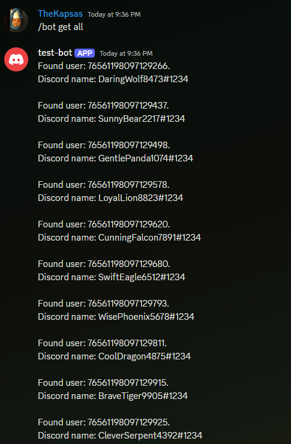

# HOW TO
## Init database
First we need to initializes the database.
Let's start the mysql docker container.
Depending on the docker version the command can very.
```
~$ sudo docker compose up -d
or
~$ sudo docker-compose up -d
```
After the database has started up we need to load example data.
To do that we need to enter the following command.
`node app/main.js init`
After that we can exit out of it with CTRL^C.
## Run the discord bot
I'm not going to go into how to setup a discord bot. If you have it set up then you can use this.
We'll need to enter some variable into `app/config/config.json` there is an example file in that directory.
In this file we can define our database connection and our discord bot command prefix and it's token.
```json
{
    "discord": {
        "token": "YOUR-TOKEN-HERE"
    },
    "bot": {
        "prefix": "/runbot"
    },
    "database": {
        "host": "localhost",
        "user": "root",
        "password": "test",
        "database": "test"
    }
}
```

After the config is done we can just `node app/main.js` or `node main.js` to start the bot.

## Test the bot
To test the bot the easiest command to use is either `help` or `get all`
Example of an output:


